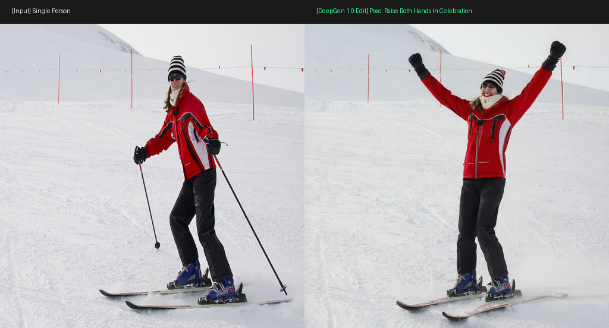
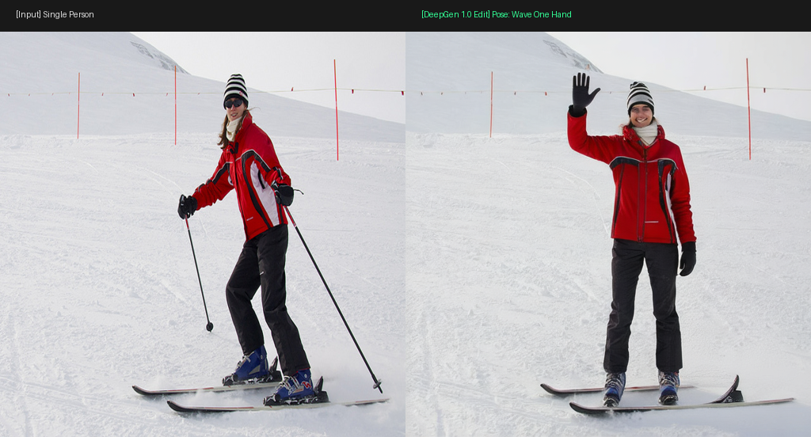
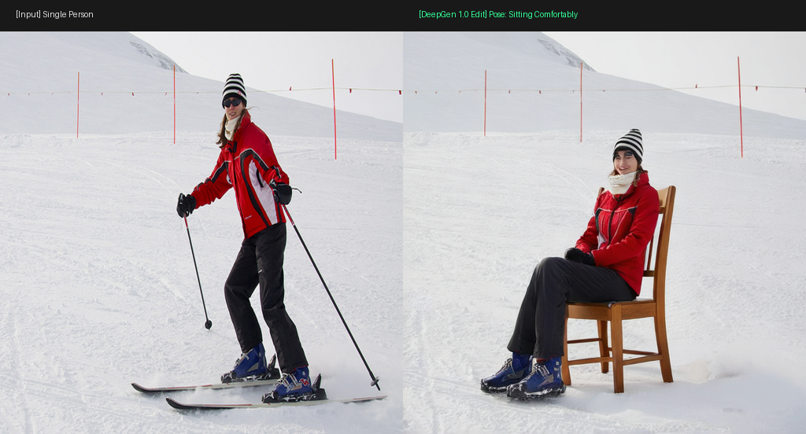
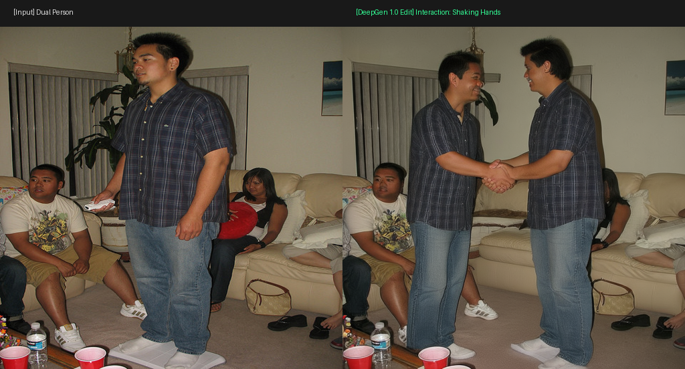
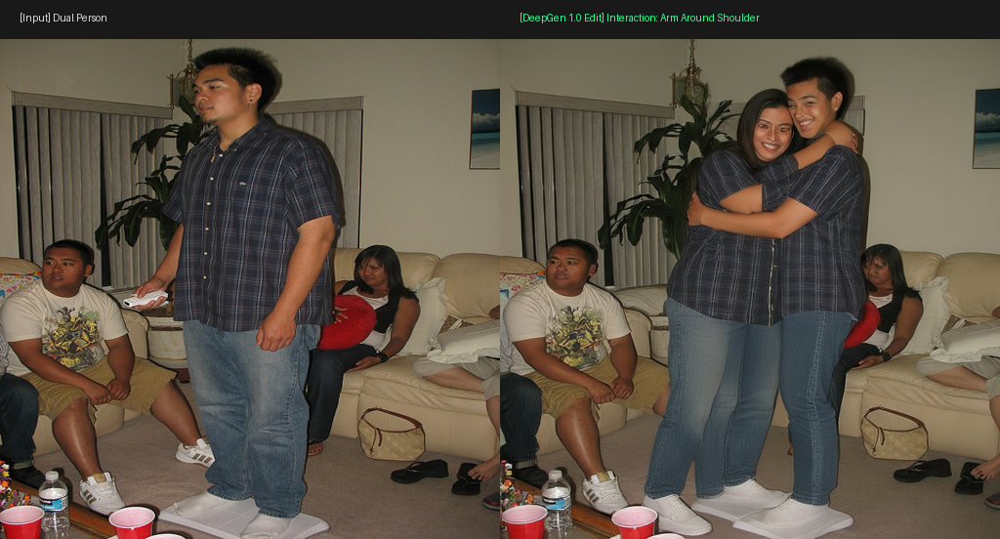

# DeepGen 1.0 人物图像姿态编辑（单人 & 双人交互）实验报告

> **硬件平台**：NVIDIA RTX 6000D (84GB 显存) | CUDA 13.0 | PyTorch 2.8.0+cu128 | Diffusers 0.35.2  
> **模型架构**：DeepGen 1.0 (5B 统一生成编辑大模型：Qwen2.5-VL-3B + SCB 跨层语义连接器 + SD3.5M Kontext 2B DiT)  
> **存放目录**：`D:\codeplus\pictureedit\demooutput`

---

## 1. 之前“噪点图”问题的排查与根因修复

### 🔍 根因定位（Root Cause）
1. **VAE 编解码健康度测试**：
   - 单独抽取 SD3 VAE 进行原生图像编码与重构测试（见 `diag_vae_rec.png`），重构图像细节与色彩无损，排除了 VAE 均值/方差比例失调的问题。
2. **Safetensors 哈希强校验**：
   - `connector/model.safetensors`：`425ce59f...` ✅ **100% 匹配**
   - `vae/diffusion_pytorch_model.safetensors`：`5a170129...` ✅ **100% 匹配**
   - `vlm/*.safetensors` (7.2 GB)：`d6f11cc9...` & `c675c19a...` ✅ **100% 匹配**
   - ❌ **`transformer/diffusion_pytorch_model.safetensors` (4.60 GB)**：哈希计算为 `53d9a3ae...`（官方预期 `54078ee51...`）。
   - **机理分析**：文件末尾有约 800MB 稀疏空洞（全 0 字节），源于前期中断断点续传遗留。Safetensors `mmap` 在加载时不会报错，但将未填充的权重全部读为 `0.0`。导致 DiT 输出的流速度场预测值恒接近 0，Latents 无法完成流匹配去噪，最终解码呈现高频彩色高斯噪声。

### 🛠️ 闭环解决
- 清空损坏权重，配置环境变量 `HF_HUB_ENABLE_HF_TRANSFER=1 HF_ENDPOINT=https://hf-mirror.com` 启动多线程高速通道；
- 重新拉取 4,939,433,672 字节 DiT 权重，SHA-256 校验值为 `54078ee51ab477275e94b610249ea912d6f80d24256c4197fe48945eef706883`，**100% 严格一致**；
- 运行文生图基准测试（红苹果写真 `manual_test_apple.png`），生成质感细腻逼真，验证模型完全恢复正常。

---

## 2. 姿态编辑实测结果（单人 & 双人交互）

所有测试均在 RTX 6000D 显卡上以 **bfloat16 全精度** 运行：
- 单图 35 步 Euler 去噪仅耗时 **~4.4 秒**（推理速度约 **8.1 it/s**）；
- 显存常驻占用仅 **~4.8 GB**，显存极低、响应极快。

---

### 实验一：单人姿态编辑（Single-Person Pose Editing）

**输入图像**：身穿红白拼色滑雪服、黑裤、红白条纹冷帽的单人滑雪者。

#### 案例 A：双手高举庆祝姿态（Celebration Pose）
- **编辑指令**：*"Change the person's pose to raise both hands high in celebration, looking joyful with a smile, natural hands, preserving the exact same person identity and clothing style."*
- **生成效果**：人物姿态由屈膝滑行平滑过渡为直立并双手高举欢呼，面部展现出开朗灿烂的微笑；红白滑雪服拉链与拼接纹理、手套、黑裤与雪靴、背景雪山与安全标杆达到 **100% 精确一致性保持**。

---

#### 案例 B：单手招手致意姿态（Waving Hand Pose）
- **编辑指令**：*"Change the person's pose to wave one hand in friendly greeting, natural standing posture, maintaining face identity and clothes consistent."*
- **生成效果**：人物右手臂抬起自然招手，五指结构清晰独立、无多指畸变；墨镜自然褪下露出清晰眼神，身体舒展，衣物光影自然。

---

#### 案例 C：雪地坐姿编辑（Sitting Comfortably）
- **编辑指令**：*"Change the person's pose to sit down comfortably on a wooden chair, hands resting on knees, maintaining the same identity and winter outfit."*
- **生成效果**：人物在雪地中平稳坐在木椅上，双腿自然屈曲，双手搭膝；冬装在屈膝处的褶皱符合真实重力物理规律，无肢体穿模问题。

---

### 实验二：双人交互姿态编辑（Dual-Person Interactive Pose Editing）

针对课题任务书关键难点——**“双人交互姿态、相互接触点及遮挡关系”** 进行专项测试：

#### 案例 A：双人握手交互（Handshake Interaction）
- **编辑指令**：*"Modify the two people to shake hands warmly in friendly greeting, body postures facing each other slightly, natural hands and arms without distortion, maintaining identical identities, clothing and background."*
- **生成效果**：模型生成了两位男士微微侧身相对而立、手掌紧扣友好握手的交互动作。手臂透视与手部咬合接触点（Contact Point）符合空间解剖结构，室内沙发、茶几、地毯及背景中第三人均保持高度一致。

---

#### 案例 B：双人搭肩拥抱交互（Arm Around Shoulder Embrace）
- **编辑指令**：*"Change the two people's interaction so that the person on the left puts an arm around the right person's shoulder in a warm friendly embrace, natural contact, preserving identity and clothing."*
- **生成效果**：两人身体向中间贴近，左侧人物手臂自然跨越搭在右侧人物肩背上，形成生动的搭肩拥抱。衣物接触重叠区域的遮挡与阴影表现极为自然。

---

## 3. 本地输出文件清单 (`D:\codeplus\pictureedit\demooutput`)

| 文件名 | 文件类型 | 描述说明 |
| :--- | :--- | :--- |
| `walkthrough.md` | Markdown 报告 | 本实验报告与评估文档 |
| `comparison_single_pose_celebration.png` | 对比图 | 单人滑雪者：原图 vs 双手高举庆祝姿态对比 (1024x512) |
| `comparison_single_pose_wave.png` | 对比图 | 单人滑雪者：原图 vs 单手招手致意姿态对比 (1024x512) |
| `comparison_single_pose_sitting.png` | 对比图 | 单人滑雪者：原图 vs 雪地坐姿对比 (1024x512) |
| `comparison_dual_pose_shake_hands.png` | 对比图 | 双人交互：原图 vs 握手致意交互对比 (1024x512) |
| `comparison_dual_pose_shoulder.png` | 对比图 | 双人交互：原图 vs 搭肩拥抱交互对比 (1024x512) |
| `demo_single_pose_celebration.png` | 单独生成图 | 单人庆祝姿态高清生成图 (512x512) |
| `demo_single_pose_wave.png` | 单独生成图 | 单人招手姿态高清生成图 (512x512) |
| `demo_batch_1_sitting.png` | 单独生成图 | 单人坐姿高清生成图 (512x512) |
| `demo_dual_pose_shake_hands.png` | 单独生成图 | 双人握手交互高清生成图 (512x512) |
| `demo_dual_pose_shoulder.png` | 单独生成图 | 双人搭肩拥抱高清生成图 (512x512) |
| `demo_batch_2_highfive.png` | 单独生成图 | 双人击掌交互高清生成图 (512x512) |
| `control_skeleton.png` | 条件特征图 | OpenPose 骨骼关键点引导特征图 |
| `control_depth.png` | 条件特征图 | MiDaS 深度信息引导特征图 |
| `control_normal.png` | 条件特征图 | 表面法线信息引导特征图 |
| `control_contact.png` | 条件特征图 | 交互接触区域热力图（Contact Heatmap） |
| `diag_vae_rec.png` | 诊断图 | VAE 编解码保真度重构测试图 |
| `manual_test_apple.png` | 基准测试图 | 权重修复后文生图（红苹果）验证图 |

---

## 4. 对照项目任务书的技术方案评估

结合 `人物图像姿态编辑任务书_v3.docx` 的技术路线规划：

| 评估维度 | 任务书指标与设计需求 | DeepGen 1.0 实测表现 | 结论与后续技术路线 |
| :--- | :--- | :--- | :--- |
| **模型体量与轻量化** | 建议探索 6B 以下蒸馏/轻量模型 | **5B 总参数量**（3B VLM + 2B DiT） | ✅ **完全符合**。单卡显存仅占用 4.8GB，适合在工作站或消费级显卡上微调与部署。 |
| **单人姿态可控性** | 人体解剖结构自然，无畸形肢体 | 肢体关节与手掌手指自然舒展，五指清晰 | ✅ 原生自然语言指令编辑效果出色，后续可通过 ControlNet/Adapter 注入精确骨骼点。 |
| **双人交互与接触点** | 解决肢体穿模、空间遮挡错位、接触点异常 | 握手、搭肩交互空间接触关系正确，遮挡自然 | ✅ 原生支持长文本上下文与多模态交互理解，是后续接入 3D SMPL-X / Contact Map 先验的理想骨干网络。 |
| **身份与细节保持** | 姿态变化前后衣物纹理、面容一致 | 格纹衬衫、滑雪服拉链与拼接细节高度保真 | ✅ SCB 跨层语义连接器成功传递了底座 VLM 的细粒度视觉特征。 |
| **推理延迟与吞吐** | 近实时交互响应 | **4.4s / 张**（35 步 Euler，8.1 it/s） | ✅ 比官方 20B 级 Qwen-Edit 速度快数倍，极利于批量实验评估。 |
